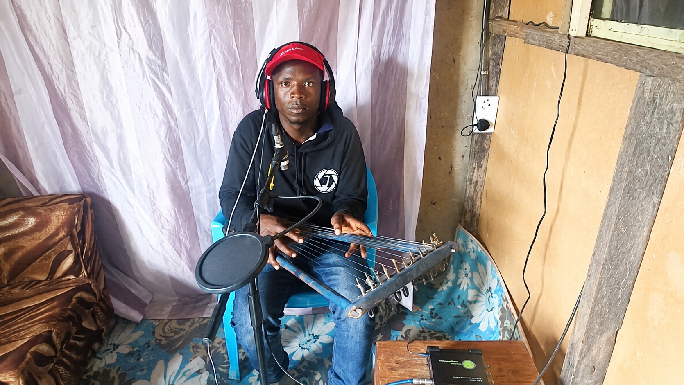
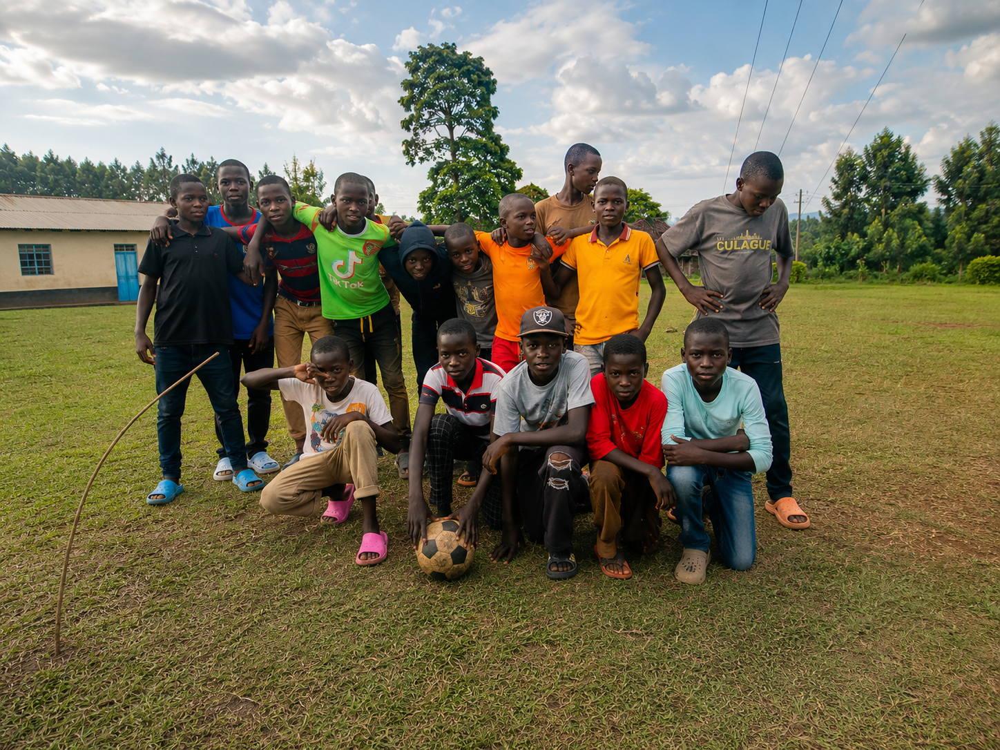
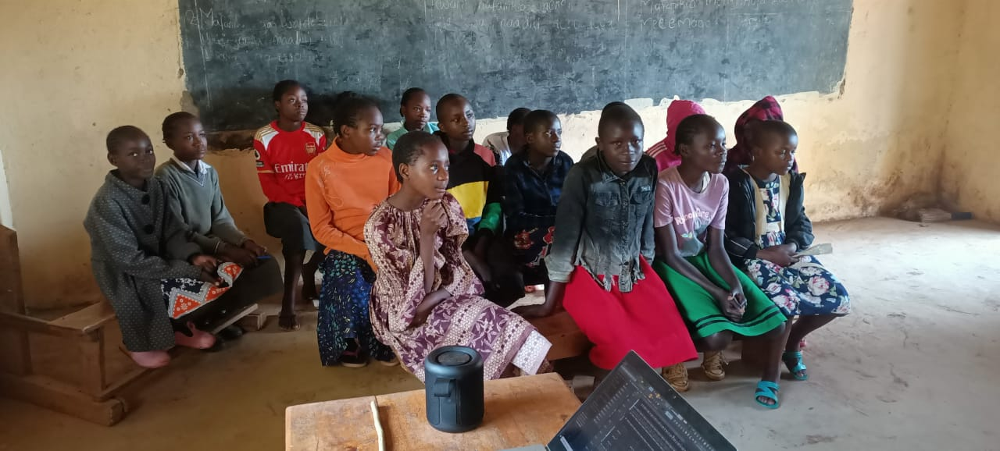

<div class="hero-section">
  <div class="hero-text">
    
<h1>
  Discovering Potential.<br>
  Creating Opportunity.<br>
  Building Community.
</h1>
<p>
  Furaha Projects is a community-centered initiative helping people discover their gifts,
  access meaningful opportunities, and contribute to stronger communities.
</p>
<a href="talents" class="hero-button">
  Explore Our Work →
</a>
</div>
<div class="hero-image">

  </div>
<div class="verse-card">
  <p>“Each of you should use whatever gift you have received to serve others.”</p>
  <span>1 Peter 4:10</span>
</div>
</div>
  <!-- =========================================
     IMPACT TRUST BAR
========================================= -->

<div class="impact-bar">

  <div class="impact-item">
    <h3>Growing</h3>
    <p>Youth Network</p>
  </div>

  <div class="impact-item">
    <h3>Community</h3>
    <p>Activities</p>
  </div>

  <div class="impact-item">
    <h3>Mentorship</h3>
    <p>Sessions</p>
  </div>

  <div class="impact-item">
    <h3>Active</h3>
    <p>Community Outreach</p>
  </div>

</div>

---
<section class="projects-section">

  <p class="projects-label">OUR PROJECTS</p>

  <h2 class="projects-heading">
    Three Projects. One Vision.
  </h2>

  <p class="projects-intro">
    Furaha Projects brings together talent development, community empowerment,
    and data-driven impact to create opportunity and build stronger communities.
  </p>

<div class="card-grid">
<div class="branch-card talents-card">
    <h3>🎨 FURAHA TALENTS</h3>
    <p>
      Discovering potential through sports, arts, mentorship,
      education, and creative expression. Furaha Talents helps
      young people identify and develop their gifts with purpose.
    </p>
    <a href="talents" class="branch-button">Learn More →</a>
  <span class="project-status active-status">Active Project</span>
  </div>

  <div class="branch-card foundation-card">
    <h3>🤝 FURAHA FOUNDATION</h3>
    <p>
      Creating opportunity through economic empowerment,
      female health education, community partnerships,
      and support for families and single parents.
    </p>
    <a href="foundation" class="branch-button">Learn More →</a>
    <span class="project-status building-status">Building</span>
  </div>
<div class="branch-card analytics-card">
    <h3>📊 FURAHA ANALYTICS</h3>
    <p>
      Measuring impact through data, research, and community
      insights. Furaha Analytics helps us understand needs,
      evaluate outcomes, and make better decisions.
    </p>
    <a href="analytics" class="branch-button">Learn More →</a>
  <span class="project-status developing-status">Developing</span>
  </div>

</div>

</section>
  
<section class="purpose-section">

  <p class="purpose-label">OUR PURPOSE</p>

  <h2 class="purpose-heading">
    Potential is everywhere.<br>
    Opportunity is not.
  </h2>


  <div class="purpose-content">

```
<p>
  We believe talent, creativity, leadership, and potential exist in every community.
  Yet many young people and families never receive the opportunities, resources,
  or support needed to fully develop those gifts.
</p>

<p>
  Furaha Projects exists to bridge that gap. Through talent development,
  community empowerment, and data-driven impact, we help individuals
  discover their strengths, access meaningful opportunities, and contribute
  to stronger communities.
</p>

<div class="purpose-verse">

  <p>
    "Each of you should use whatever gift you have received
    to serve others, as faithful stewards of God's grace
    in its various forms."
  </p>

  <span>1 Peter 4:10</span>

</div>
```

  </div>

</section>


<!-- =========================================
     FURAHA TALENTS IN ACTION SECTION/ Programs cards section 
========================================= -->

<section class="programs-section">

  <p class="section-label">FURAHA TALENTS IN ACTION</p>

  <h2 class="section-heading">
    Real stories. Real growth. Real impact.
  </h2>

  <p class="section-subtext">
    Through creative arts, sports, mentorship, education, and design,
    Furaha Talents creates spaces where young people can discover and develop their gifts.
  </p>
<div class="program-cards">

    <!-- Creative Arts -->
    <div class="program-card">

      

      <div class="program-icon purple-icon">
        🎵
      </div>

      <div class="program-content">
        <h3>Creative Arts</h3>

        <p>
          Nurturing creativity and self-expression through music,
          art, performance and storytelling.
        </p>

        <a href="#">Learn More →</a>
      </div>
    </div>

    <!-- Sports -->
    <div class="program-card">

      

      <div class="program-icon yellow-icon">
        ⚽
      </div>

      <div class="program-content">
        <h3>Sports & Athletics</h3>

        <p>
          Building teamwork, discipline and confidence through
          sports and active youth engagement.
        </p>

        <a href="#">Learn More →</a>
      </div>
    </div>

    <!-- Mentorship -->
    <div class="program-card">

      

      <div class="program-icon teal-icon">
        🎓
      </div>

      <div class="program-content">
        <h3>Mentorship & Education</h3>

        <p>
          Empowering young people through guidance, learning,
          leadership and educational support.
        </p>

        <a href="#">Learn More →</a>
      </div>
    </div>

    <!-- Fashion -->
    <div class="program-card">

      

      <div class="program-icon pink-icon">
        ✨
      </div>

      <div class="program-content">
        <h3>Fashion & Design</h3>

        <p>
          Inspiring innovation and confidence through fashion,
          design and creative expression.
        </p>

        <a href="#">Learn More →</a>
      </div>
    </div>

  </div>

</section>
 

  

