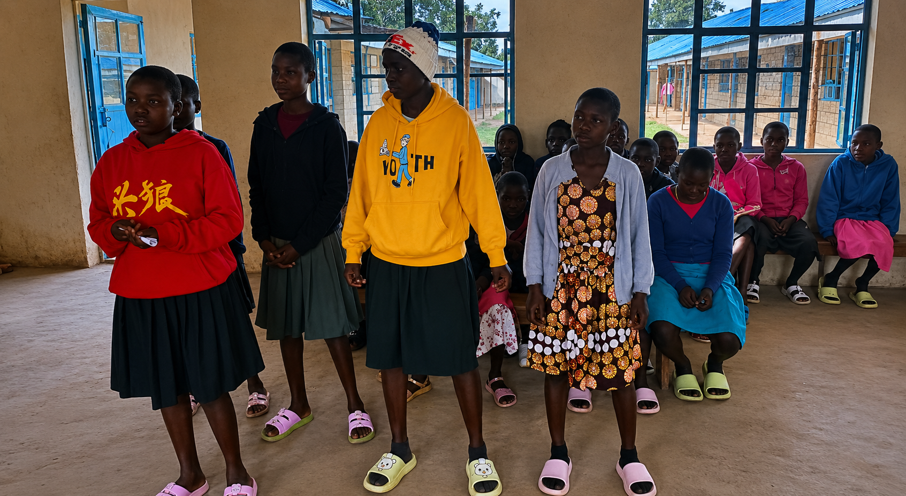
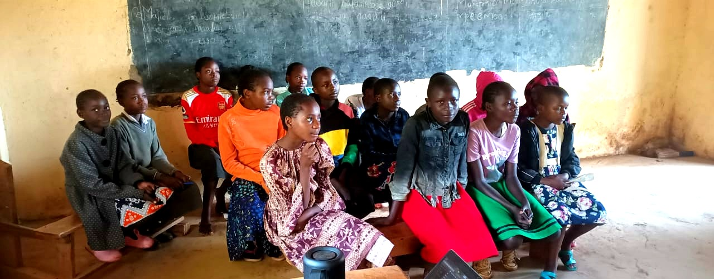
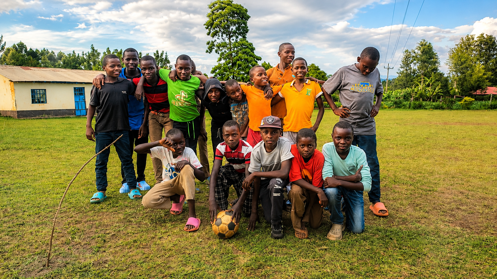

## Operational Headquarters & Master Command Hub

Furaha Projects HQ operates as the centralized command hub powering a diverse network of specialized community initiatives. Guided by Christian principles, this platform orchestrates localized operations in youth creative development, maternal economic relief, and transparent statistical impact mapping.

---

## 📸 Community Impact Gallery

  

    
    Foundations of Leadership
  

  
  

    
    The Creative Spark
  

  
  

    
    Unity in Action
  

---

> ## Our Mission & Vision
> Guided by the Bible verse: **1 Peter 4:10**, our mission is to be able to use the talents and abilities we are blessed with to bless others and to live and serve others. As we believe that charity begins at home, our vision is to start community and personal development of our God-given talents through presentation of opportunities and nurturing for long-term results.

---

## Core Operational Pillars
* **🌍 Community Outreach:** Organizing direct support frameworks for children and families.
* **📚 Education Support:** Bridging resources and local literacy gaps for everyone in the community.
* **📊 Data Transparency:** Applying statistical mapping and predictive growth metrics to track and display our direct local network impact.

---

## 🏛️ OPERATIONAL BRANCH PORTALS

  

  

    <h3>🎨FURAHA TALENTS</h3>
    
Identifying and cultivating youth creative leadership via the Talanta Gala.

    <a href="talents" class="branch-button">Launch Portal →</a>
  

<h3>🏥FURAHA FOUNDATION</h3>

 Economic empowerment and employment pipelines for mothers and vital health resource support.

<a href="foundation" class="branch-button">Launch Portal →</a>

  <h3>📊FURAHA ANALYTICS</h3>
  
Applying statistical tracking and predictive modeling to measure, optimize, and display our network's direct community impact metrics. 

  System Launching Soon

